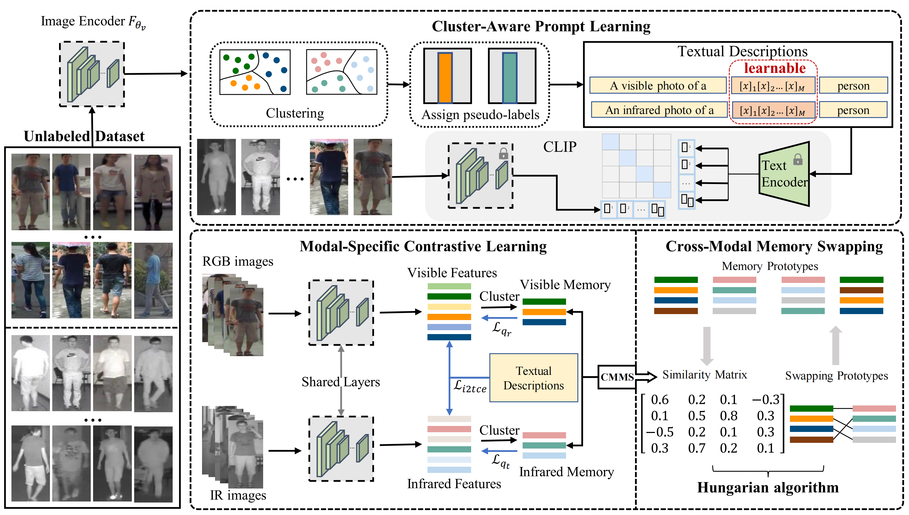

## Unveiling the Power of CLIP in Unsupervised Visible-Infrared Person Re-Identification [[pdf]](https://dl.acm.org/doi/pdf/10.1145/3581783.3612050)

This is Official Repository for "Unveiling the Power of CLIP in Unsupervised Visible-Infrared Person Re-Identification", which is accepted by ACM MM 2023. This work is done at the DMCV Laboratory of East China Normal University. You can link at [DMCV-Lab](https://dmcv-ecnu.github.io/) to find DMCV Laboratory website page.


### Update Time
-- 2023-11-19 We release the code to github.

### Method



### Installation

```
conda create -n cclnet python=3.9
conda activate cclnet
conda install pytorch==1.12.1 torchvision==0.13.1 torchaudio==0.12.1 cudatoolkit=11.3 -c pytorch
conda install tqdm
conda install scikit-learn

pip install yacs
pip install timm
pip install scikit-image
pip install ftfy
pip install easydict
pip install regex
pip install faiss-gpu
```

### Prepare Dataset

- (1) RegDB Dataset [5]: The RegDB dataset can be downloaded from this [website](http://dm.dongguk.edu/link.html) by submitting a copyright form.

    - (Named: "Dongguk Body-based Person Recognition Database (DBPerson-Recog-DB1)" on their website). 
  
- (2) SYSU-MM01 Dataset [6]: The SYSU-MM01 dataset can be downloaded from this [website](http://isee.sysu.edu.cn/project/RGBIRReID.htm).

   - run `python data/process.py` to pepare the dataset, the training data will be stored in ".npy" format.

### Training

For example, if you want to run CCLNet for the SYSU-MM01, you need to train a model to get pseudo_labels for later CLIP training.

```
CUDA_VISIBLE_DEVICES=0 python train_prepare.py
```
This will get a model(without L_it2ce) and two modal pseudo_lables(two '.npy' format files in you DataSet dir).

Later you have to train again, so you need to ensure that the dataset folder contains the pseudo-label file generated in the previous step, or you can download the [pseudo_labels](https://drive.google.com/drive/folders/1Ysl8tHZ1ZmKlFXnuJHWBZJ9Giel0Q6nZ?usp=drive_link) we trained into '/SYSU-MM01/pseudo_labels/train_xx_resized_pseudo_label.npy'. You have to run:
```
mkdir /dataset/SYSU-MM01/pseudo_labels/
download '.npy' into /dataset/SYSU-MM01/pseudo_labels/

# training
CUDA_VISIBLE_DEVICES=0 python train_clip.py 
```

### Evaluation

For example, if you want to test CCLNet for SYSU-MM01, you have to run:

```
CUDA_VISIBLE_DEVICES=0 python test.py --resume_path 'checkpoints/model_best.pth'
```

### Acknowledgement

Codebase from [CLIP](https://github.com/openai/CLIP)[1], [CoOp](https://github.com/KaiyangZhou/CoOp)[2], [CLIP_ReID](https://github.com/Syliz517/CLIP-ReID)[3] and [Cluster Contrast](https://github.com/alibaba/cluster-contrast-reid)[4]. Thanks for their contributions to open-source code.

### Trained models
| Settings                    | Pretrained | Loss | Rank@1 | mAP | Model(pth)                 |
|-----------------------------|------------|---|--------|-----|-----------------------|
| SYSU-MM01(train_prepare.py) | CLIP     | L_qr+L_qt | ~50.02%     | ~45.52%  | [model_perpare.pth](https://drive.google.com/file/d/1mK41qVbKmWHQLgfSPijk0RYDrWVJdOsG/view?usp=drive_link) |
| SYSU-MM01(train_clip.py)    | CLIP     | L_qr+L_qt+L_i2tce  | ~55.31%     | ~50.38%  | [model_best.pth](https://drive.google.com/file/d/1-qniQHrgmVYxERh62hacV0Kt07y_sZuU/view?usp=drive_link) |

### 4.Citation

If you use this code for your research, please cite

```
@inproceedings{chen2023unveiling,
  title={Unveiling the Power of CLIP in Unsupervised Visible-Infrared Person Re-Identification},
  author={Chen, Zhong and Zhang, Zhizhong and Tan, Xin and Qu, Yanyun and Xie, Yuan},
  booktitle={Proceedings of the 31st ACM International Conference on Multimedia},
  pages={3667--3675},
  year={2023}
}
```
### References.

[1] Bianchi, Federico, et al. "Contrastive language-image pre-training for the italian language." arXiv preprint arXiv:2108.08688 (2021).

[2] Zhou, Kaiyang, et al. "Learning to prompt for vision-language models." International Journal of Computer Vision 130.9 (2022): 2337-2348.

[3] Li, Siyuan, Li Sun, and Qingli Li. "Clip-reid: Exploiting vision-language model for image re-identification without concrete text labels." Proceedings of the AAAI Conference on Artificial Intelligence. Vol. 37. No. 1. 2023.

[4] Dai, Zuozhuo, et al. "Cluster contrast for unsupervised person re-identification." Proceedings of the Asian Conference on Computer Vision. 2022.

[5] D. T. Nguyen, H. G. Hong, K. W. Kim, and K. R. Park. Person recognition system based on a combination of body images from visible light and thermal cameras. Sensors, 17(3):605, 2017.

[6] A. Wu, W.-s. Zheng, H.-X. Yu, S. Gong, and J. Lai. Rgb-infrared crossmodality person re-identification. In IEEE International Conference on Computer Vision (ICCV), pages 5380–5389, 2017.
